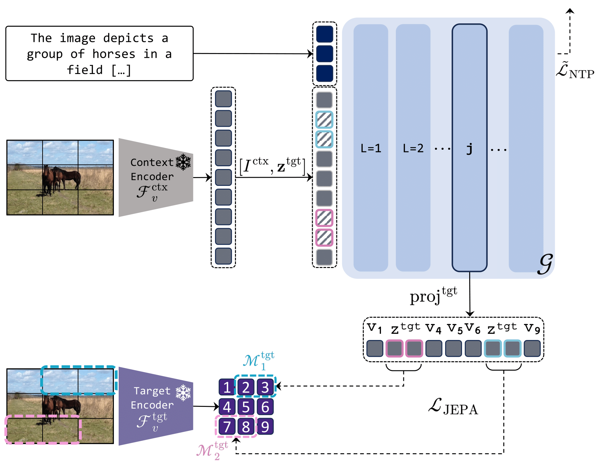

<div align="center">
  <h1>Seeing Beyond Words: Self-Supervised Visual Learning for Multimodal Large Language Models</h1>
</div>

<div align="center">

  [](https://arxiv.org/abs/2512.15885)
  [](https://huggingface.co/collections/aimagelab/jarvis)
</div>

<p align="center">
  
</p> 

Please cite with the following BibTeX:
```
@article{caffagni2025seeing,
  title={{Seeing Beyond Words: Self-Supervised Visual Learning for Multimodal Large Language Models}},
  author={Caffagni, Davide and Sarto, Sara and Cornia, Marcella and Baraldi, Lorenzo and Dovesi, Pier Luigi and Roohi, Shaghayegh and Granroth-Wilding, Mark and Cucchiara, Rita},
  journal={arXiv preprint arXiv:2512.15885},
  year={2025}
}
```
